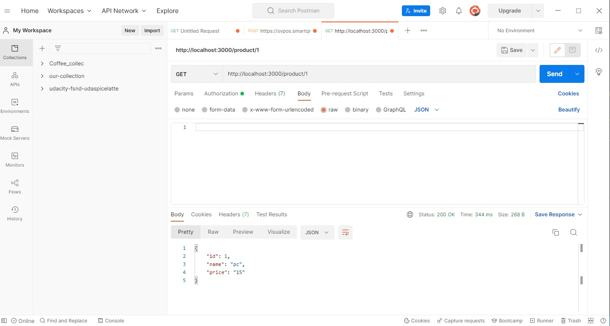

# API Requirements
The company stakeholders want to create an online storefront to showcase their great product ideas. Users need to be able to browse an index of all products, see the specifics of a single product, and add products to an order that they can view in a cart page. You have been tasked with building the API that will support this application, and your coworker is building the frontend.

These are the notes from a meeting with the frontend developer that describe what endpoints the API needs to supply, as well as data shapes the frontend and backend have agreed meet the requirements of the application. 

## API Endpoints
### Products
- Index 

- Show (args: product id)

- Create (args: Product)[token required]

- [OPTIONAL] Top 5 most popular products 
- [OPTIONAL] Products by category (args: product category)

### Users
- Index [token required]

- Show (args: id)[token required]

- Create (args: User)[token required]

### Orders endpoints
- Create [token required] : `'/order' [POST]`
Token is authorized

Token is unauthorized

- Get all orders [token required]: `'/orders' [GET]`

- Delete product [token required]: `'/order' [DELETE]`

- Active Order by user (args: user id) [token required] : `'orders/users/:userId/active' [GET]`
- Completed Orders by user (args: user id) [token required] `'orders/users/:userId/completed' [GET]`

## Data Shapes
#### Product
-  id
- name
- price
- [OPTIONAL] category

#### User
- id
- firstName
- lastName
- password

#### Orders
- id
- id of each product in the order
- quantity of each product in the order
- user_id
- status of order (active or complete)

